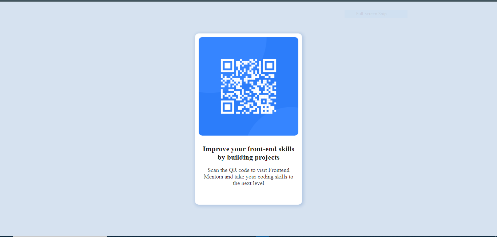

# Scan-QR-Code

# Frontend Mentor - QR code component solution

This is a solution to the [QR code component challenge on Frontend Mentor](https://www.frontendmentor.io/challenges/qr-code-component-iux_sIO_H). Frontend Mentor challenges help you improve your coding skills by building realistic projects.

## Table of contents

- [Overview](#overview)
  - [Screenshot](#screenshot)
  - [Links](#links)
- [My process](#my-process)
  - [Built with](#built-with)
  - [What I learned](#what-i-learned)
  - [Useful resources](#useful-resources)
- [Author](#author)

## Overview

This is a simple responsive QR Code page. It requires the use of only HTML5 and CSS to complete.

### Screenshot



### Links

- Solution URL: [Add solution URL here](https://github.com/ThisMide/Scan-QR-Code)
- Live Site URL: [Add live site URL here](https://thismide.github.io/Scan-QR-Code/)

## My process

- My process was simply using HTML5 and CSS for styling, using mostly flex display and resizing to fit. Then making the page responsive with @media "tag".

### Built with

- Semantic HTML5 markup
- CSS custom properties
- CSS flexbox

### What I learned

I was able to learn how to make a page responsive, i'v always had idea, but with the process being required to complete this project, it really gave opportunity to utilize and familiarize myself with it. Example below. Though, i mighty not be perfect yet, but i guess it's a start...

```css
@media (max-width: 1088px) {
  .lettering-div h2 {
    font-size: 15px;
  }
  .lettering-div p {
    font-size: 12px;
  }

  .main {
    height: 60%;
  }
}
```

### Useful resources

- [Example resource 1](https://www.youtube.com/watch?v=K24lUqcT0Ms&t=286s) - This helped me in the area of making the page responsive.

## Author

- Website - [Olumide](https://github.com/ThisMide)
- Frontend Mentor - [@ThisMide](https://www.frontendmentor.io/profile/ThisMide)
